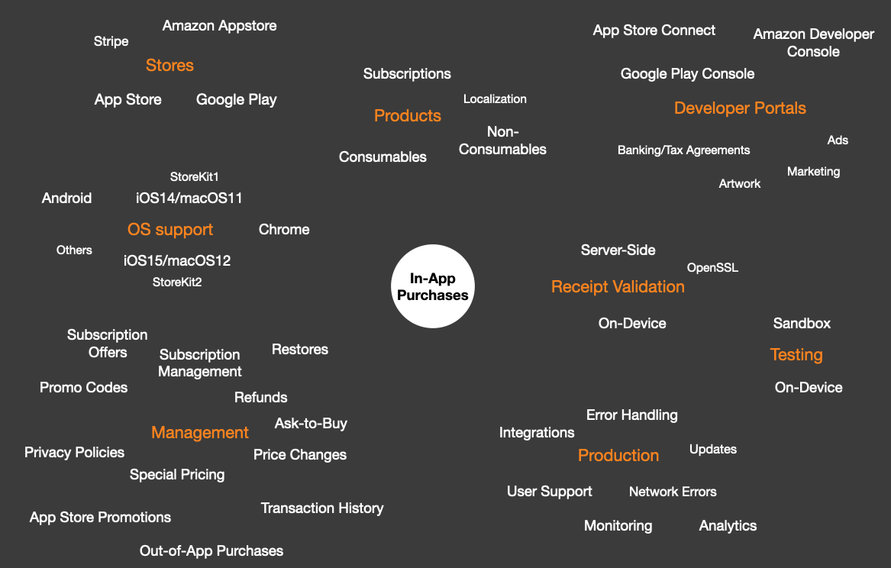
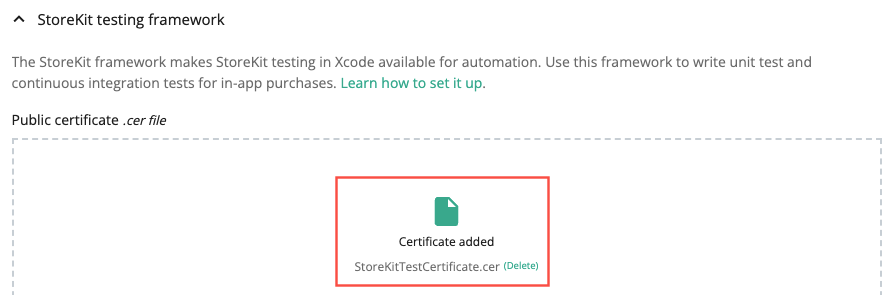
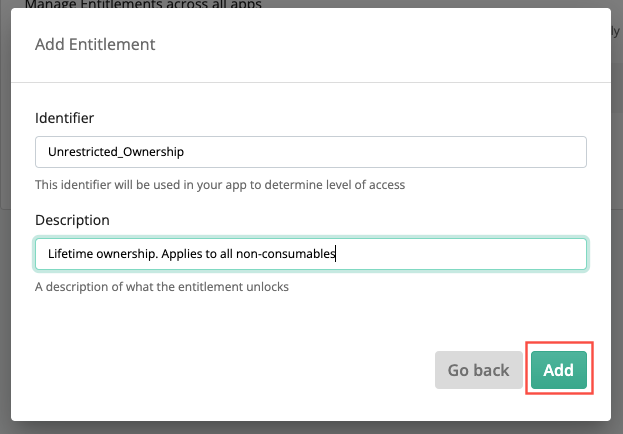
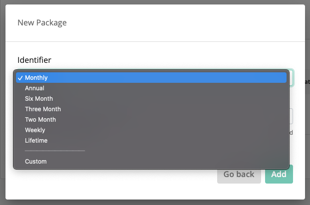

# In-App Purchases with RevenueCat

Using **RevenueCat** to implement in-app purchases in Xcode 13, Swift 5.5, SwiftUI, iOS 15 and macOS 12.

# Introduction


This document discusses how to use **RevenueCat** to implement in-app purchases in a **SwiftUI**-based **iOS** and **macOS** demo app. 

We briefly review some background information related to in-app purchases, RevenueCat and the various options available for implementing in-app purchases. We then work through an example of how to setup RevenueCat and use the `Purchases` SDK to implement in-app purchases in a simple demo app.

If you wish, you can skip the preamble and jump straight to [Getting started](#Getting-started) with the demo.

This document assumes you have basic familiarity with App Store Connect, Xcode, Swift and SwiftUI. We assume no knowledge of working with in-app purchases.

---

# Contents
- [Introduction](#Introduction)
- [Contents](#Contents)
- [Background](#Background)
- [Monetization choices](#Monetization-choices)
- [In-app purchases choices](#In-app-purchases-choices)
- [Do-it-yourself complexity](#Do-it-yourself-complexity)
- [Multi-platform complexity](#Multi-platform-complexity)
- [Reasons to use RevenueCat](#Reasons-to-use-RevenueCat)
- [Reasons not use RevenueCat](#Reasons-not-use-RevenueCat)
- [Getting started](#Getting-started)
- [Creating a RevenueCat account](#Creating-a-RevenueCat-account)
- [Creating a RevenueCat project](#Creating-a-RevenueCat-project)
- [Getting the shared secret from App Store Connect](#Getting-the-shared-secret-from-App-Store-Connect)
- [App overview](#App-overview)
- [Configure product information](#Configure-product-information)
	- [Configuring products in Xcode](#Configuring-products-in-Xcode)
	- [Non-consumable products](#Non-consumable-products)
	- [Subscription products](#Subscription-products)
	- [Enable StoreKit Testing via the Project Scheme](#Enable-StoreKit-Testing-via-the-Project-Scheme)
	- [Enable StoreKit Testing in RevenueCat](#Enable-StoreKit-Testing-in-RevenueCat)
- [Key RevenueCat concepts](#Key-RevenueCat-concepts)
	- [Projects](#Projects)
	- [Apps](#Apps)
	- [Products](#Products)
	- [Entitlements](#Entitlements)
	- [Packages](#Packages)
	- [Offerings](#Offerings)
- [Complete the app in Xcode](#Complete-the-app-in-Xcode)
	- [Add the RevenueCat package](#Add-the-RevenueCat-package)
	- [Organize the Xcode project](#Organize-the-Xcode-project)
	- [Create the ViewModel](#Create-the-ViewModel)
	- [Displaying products](#Displaying-products)
	- [Purchasing a product](#Purchasing-a-product)
	- [Is a product purchased](#Is-a-product-purchased)
	- [Displaying purchase data](#Displaying-purchase-data)
- [Clearing test purchase data](#Clearing-test-purchase-data)
- [Viewing transactions on the RevenueCat dashboard](#Viewing-transactions-on-the-RevenueCat-dashboard)
- [Conclusions](#Conclusions)

# Background
Working with in-app purchases is *hard*. If you’ve not tackled it before, implementing and testing in-app purchases is daunting, complex and seems _way_ more involved than you’d expect! There are a huge number of tasks and things to consider, even before you get to coding! 



# Monetization choices
If you want to make money through your app you have three choices:

**Charge up-front for the app**
- **Pros**: Simple. Just tell Apple how much to charge users and let the App Store handle collecting the revenue
- **Cons**: May not work, unless you're selling something people *really* want, like Logic Pro or a big-name game

**Include ads**
- **Pros**: Simple. A number of companies provide SDKs that enable developers to easily include in-app advertising
- **Cons**: Everybody *hates* ads! Unless the app is pretty successful you probably won't make much money

**Have a free app and offer in-app purchases**
- **Pros**: Successful. Users like and accept this model. You will make (at least some) money, even with moderately successful apps
- **Cons**: Complex. If you take a do-it-yourself approach there's a surprisingly large amount of complex code to develop. Hard to do it correctly

Personally, I've tried all three approaches and found that having a free app with in-app purchases is **by far** the best solution. 

# In-app purchases choices
Essentially, there are two paths:

- **Write the code yourself**
	- Use the appropriate SDK provided by the platform vendor (e.g. Apple's `StoreKit`, Google Play Billing Library, etc.)
	- The in-app purchase code for each platform (iOS, Android, etc.) targeted by your app will require a custom solution
	- Requires in-depth knowledge of each platform's in-app purchase SDK

- **Use a third-party service** (e.g. **RevenueCat**)
	- The service will provide an SDK or web API that forms an abstraction layer on top of the platform vendor's SDKs
	- Each platform targeted by your app will use a unified in-app purchase model
	- The complexity of each platform's in-app purchase SDK is hidden from the developer

# Do-it-yourself complexity
When I first implemented in-app purchases using a do-it-yourself approach in 2016 the main pain-points were:

- **Documentation and examples**. For something so fundamentally important, it seemed to me there was a real lack of *good* documentation and examples. As I began to create a solution I had a horrible, nagging feeling that I had missed something vital that would only become apparent when the app went live (actually, it was fine!). I spent more time developing the in-app purchase-related code than on the rest of the app

- **Receipt validation options**. The App Store issues an encrypted receipt for in-app purchases. Reading the contents of the receipt and validating the data "on-device" is decidedly non-trivial and requires working with low-level OpenSSL cryptographic functions. The alternative to on-device validation is to set up an app server to communicate with the App Store server (server-based validation). But, this means you've got all the bother and expense of setting up a server and maintaining it

- **Sandbox accounts**. Prior to Xcode 12, in order to test in-app purchases you had to create multiple sandbox test accounts in App Store Connect. Each sandbox account has to have a unique email address and be validated as an AppleID. To make things more painful, each time you make a purchase that sandbox account becomes "used up" and can’t be used to re-purchase the same product, as there’s no way to clear purchases. Starting with Xcode 12, Apple introduced a new local StoreKit testing environment that allows you to test in-app purchases in the simulator, without having to set anything up in App Store Connect

Things have improved significantly with Apple's `StoreKit2` and **Xcode 13/iOS 15**, particularly with respect to receipt validation. `StoreKit2` now uses JSON Web Signature (`JWS`) as a secure container for transaction information signed by the App Store. JWS is easy to read and it means there's no need for a third-party cryptography library. Better still, transactions are now **automatically** validated by `StoreKit2`!

If your app is going to target only iOS 15/macOS 12 and higher, you can use a `StoreKit2`-based approach. For more details on using the (complex) do-it-yourself approach, see:

- Using `StoreKit1` to create [in-app purchases for iOS 14/macOS 11](https://github.com/russell-archer/IAPDemo)
- Using `StoreKit2` to create [in-app purchases for iOS 15/macOS 12](https://github.com/russell-archer/StoreHelper)

# Multi-platform complexity
What happens if your app is targeting iOS *and* Android? Your team now has to develop of ***two*** sets of in-app purchase code using radically different tools (Xcode and Android Studio), languages (Swift and Kotlin/Java), SDKs (StoreKit and Google Play Billing Library) and dissimilar underlying architectures and technologies. 

The complexity and up-front investment required is significant. If you were designing a solution for this problem, you'd probably consider creating some kind of abstraction framework that presents a unified architecture and API across the different platforms. And perhaps you'd need to extend your framework to work with Java, and so on. You'd also want some kind of web-based dashboard that presents unified information on sales, subscriptions, trials, conversions, active users, etc. Oh, and charts, you'd definitely want charts. Implementing all this would be, as Tom Cruise might say, "a challenge". 

# Reasons to use RevenueCat
The stand-out reason for using RevenueCat is that it's **so much quicker and easier** than directly using Apple's StoreKit or Google Play Billing Library. Having (twice) spent **a lot** of time and effort developing (and then re-developing for StoreKit2) Swift-based in-app purchase code, I really wish I'd not bothered and used RevenueCat instead!

- RevenueCat provides an SDK that forms a clean, simple, unified interface over the underlying complexities of the App Store, Google Play, Amazon Appstore, etc.
- RevenueCat handles all types of in-app purchase: consumables, non-consumables and subscriptions
- You don't need an in-depth understanding of multiple store architectures and SDKs. Using RevenueCat you do things the **same way** for iOS, Android, React Native, Unity, etc. And using the RevenueCat SDK is *way* simpler than directly using Apple's StoreKit or Google Play Billing Library
- RevenueCat's SDK natively supports all the languages your app requires: Swift, Objective-C, Kotlin, Java, Flutter, React Native, and more
- RevenueCat are well-know, widely-used and respected. For example, big-names like **Notion** use RevenueCat
- RevenueCat automatically handles edge cases and "gotchas" (parental permissions, users with multiple levels of subscription to the same product, etc.)
- RevenueCat handles receipt validation for you (yes!)
- A near real-time web dashboard provides app analytics and charts that pull data from the App Store, Google Play, Amazon Appstore, etc. to form a "single source of truth"
- Integration with your existing backend systems (e.g. Amazon S3, Apple Search Ads, Google Cloud, Slack, Stripe, etc.) via webhooks
- Free to try and free to use **in production**! You won't pay anything to use the service until your app makes significant revenue ($10k or more a month). A reassuring pricing calculator on the RevenueCat website shows that on the Starter plan you'd only pay $80 if your app earns $10,000 a month

# Reasons not use RevenueCat
One reason you might hesitate to embrace RevenueCat is **feature lag**. Any product that encapsulates, extends or aggregates the functionality of another product or service will necessarily exhibit a certain amount of latency, or lag when new features are introduced to the underlying products or services. 

For example, at the time of writing (February, 2022) RevenueCat have not yet released support for the `StoreKit2` changes introduced in iOS 15/macOS 12 and Xcode 13. However, it looks like this is coming soon, as a release candidate (version 4) is available to try via [GitHub](https://github.com/RevenueCat/purchases-ios/blob/4.0.0-beta.9/docs/V4_API_Updates.md). In this particular example, the delay has to be seen in the context that in adding support for StoreKit2 RevenueCat have also rewritten their entire Objective-C code base in Swift! 

---

# Getting started
In this demo we'll use RevenueCat to create a demo app for iOS and macOS named **RCFlowers4U**. The app allows the user to purchase **non-consumable** products like bunches of flowers, as well as **subscription** services for plant maintenance. The demo is available on GitHub at https://github.com/russell-archer/Flowers4U.

> You may be surprised at just how little code is required to create an app that supports a fully-functional in-app purchase system. Most of the work is simply a matter of *configuring* your products in the app, the App Store and RevenueCat.

# Creating a RevenueCat account
The first thing we need to do is create an account. You can signup for free at https://app.revenuecat.com/signup:


# Creating a RevenueCat project
Having created our account we now need to create a **Project**. RevenueCat uses projects to create a group of related apps. For example, if we were going to develop an Android version of Flowers4U the RevenueCat project would contain two apps. Note that even if you'll only have one app, you still need to create a project.

From your RevenueCat dashboard, select **Projects > Create new project**:


Provide a name for the project, then tap **Create project**:


As suggested, we can now add one or more apps to the RCFlowers4U project. Tap **App Store**:


There are three things we need to setup:

1. The app's **name** (Flowers4U)
2. The app's **Bundle ID**, which we can get from Xcode when we create the app
3. The app-specific **Shared Secret** from App Store Connect. We'll do that later: see [[#Getting the shared secret from App Store Connect]] below


To make things easy, let's switch to Xcode and create the SwiftUI-based app using the **File > New Project > Multiplatform > App** template:


Name the project "RCFlowers4U", make a note of the bundle ID, then complete the creation of the Xcode project:


Switch back to the RevenueCat dashboard, enter the **App name** and **App Bundle ID** in the app setup page, then tap **Save changes**:


# Getting the shared secret from App Store Connect
We now need to setup a mechanism that will allow RevenueCat to securely communicate on our behalf with the App Store. The way this is done is to use an app-specific **Shared Secret** (a key). In order to generate the required key we first need to create an **Identifier** for our app, and then define the app itself in App Store Connect.

Navigate to https://developer.apple.com/, sign in to your account, then select **Certificates, Identifiers & Profiles**:


Select **Identifiers** in the sidebar, then tap the "**+**" to add a new identifier for our app:


Select to register a new **App ID**:


Select **App** as the type:


Enter the app's **Bundle ID**, a description, then tap **Continue** and **Register**:


Now navigate to [App Store Connect](https://appstoreconnect.apple.com/), select **Apps** and create a **New App**:


Enter the app's **Name** (you'll have to use something other than "RCFlowers4U") and **Primary Language**, then select the **Bundle ID** associated with the **App ID** we just created:


Once the app's been successfully created, select it, then navigate to the **In-App Purchases** page. Tap **App-Specific Shared Secret**:


Tap **Generate App-Specific Shared Secret**:


The app's unique key is generated:


Copy the key. Now switch back to the RevenueCat dashboard, tap **Set secret** and paste the shared secret into the **App Store Connect App-Specific Shared Secret** field:


# App overview
Having completed the first stage of RevenueCat setup, we can now focus on the basics of the RCFlowers4U app.

For this demo we'll create a simple multi-platform (iOS 15/macOS 12) SwiftUI app for a fictional on-line florist that sells a range of flowers, chocolates and other related services like VIP home visits to water and care for house plants. 

- The UI for the app will consist of a list of products
- Each product will have a name, an image and some descriptive text
- A button displays each product's price, or, if the product has already been purchased, a green checkmark will be displayed
- Tapping the price button triggers the purchase process
- Below each product will be an "Info" button (for products that have not been purchased), or information related to the product's purchase or subscription status

It'll look like this when complete:


The app will require us to support two types of in-app purchase products:

- **Non-consumables** (cut flowers and chocolates). Non-consumable products are one-time purchases which never expire
- **Subscriptions** (VIP plant home care: scheduled home visits to water and care for house plants). Subscriptions auto-renew at end of the subscription period

During the course of creating the app we'll see how to:

- **Configure** product information in **Xcode**, **App Store Connect** and **RevenueCat**
- Use the RevenueCat `Purchases` SDK to:
	- request **localized product information** 
	- check if a product has been **purchased**
	- **purchase** a product and **validate the transaction**
	- handle **cancelled** and **failed transactions**
	- display **transaction information** for non-consumables and subscriptions
- View transaction data in the RevenueCat **dashboard**

# Configure product information
We have to configure in-app purchase product information in **three** different places: Xcode, App Store Connect and RevenueCat. Happily, we'll mostly be copying and pasting the same data.

## Configuring products in Xcode
Before we do anything else, we need to give our iOS and macOS targets the in-app purchase **capability**.

Select the **iOS** target, on the **Signing & Capabilities** tab tap **+ Capability** and add **In-App Purchase**:


Repeat the process for the macOS target. You'll now see that Apple's **StoreKit** framework has been added to both targets:


Now we need to configure the products our app will be selling, and we're going to take a shortcut so we can get our app up and running quickly!

Introduced in Xcode 12, a new local StoreKit test environment allows you to do early testing of in-app purchase in the simulator, *without* first having to set anything up in App Store Connect. You define your products *locally* in a **StoreKit Configuration** file which gives you the ability to view and delete transactions, issue refunds, and a whole lot more. RevenueCat fully supports this new local testing approach.

Create a new **Group** folder below the **Shared** folder and name it **Configuration**. 
Create a **StoreKit Configuration File** in the Configuration folder by selecting **File > New > File** and choosing the **StoreKit Configuration File** template. 
Name the file **Products.storekit**:


## Non-consumable products
Click **+** to add an in-app purchase. Select the **Add Non-Consumable In-App Purchase** option:


You can now define the first non-consumable product:


Notice how each product is uniquely defined by a **Product ID**. This can be anything you like, but I always use ids with the format "com.{developer}.{app}.{product-type}.{product-name}".

The fields available are as follows:

-   **Type**. The type of product (Non-Consumable, Consumable, Non-Renewing, Auto-Renewing)
-   **Reference Name**. A short descriptive reference for the product. Not visible to users
-   **Product ID**. The unique code used to identify an IAP product. This same ID will be used in App Store Connect when setting up in-app purchases for production. Not visible to users
-   **Price**. A hard-coded price for the product. In production your app will request localized price (and other) information from the App Store. Visible to users
-   **Family Shareable**. True if purchases can be shared by family members, false otherwise. Visible to users
-   **Locale**. By default, the first localization is for the US store. This is used if no other localizations are defined. You can add as many localizations as required. Visible to users
-   **Description**. A short description of the product. Visible to users
-   **Display Name**. The name for the product that users see

> Note that none of the data defined in the .storekit file is ever uploaded to App Store Connect. It’s only used when testing in-app purchases locally in Xcode.

Our **non-consumable** products are defined as follows:

```text
Product ID:        com.rarcher.rcflowers4u.nonconsumable.flowers.large
Reference Name:    flowers-large
Price:             1.99
Family Shareable:  true
Locale:            English (US)
Description:       A cool bunch of mixed flowers
Display Name:      Large Flowers
Locale:            English (UK)
Description:       Lovely large flowers
DisplayName:       Large Flowers

Product ID:        com.rarcher.rcflowers4u.nonconsumable.flowers.small
Reference Name:    flowers-small
Price:             0.99
Family Shareable:  true
Locale:            English (US)
Description:       A cool small bunch of flowers
Display Name:      Small Flowers
Locale:            English (UK)
Description:       Nice small flowers
Display Name:      Small Flowers

Product ID:        com.rarcher.rcflowers4u.nonconsumable.roses.large
Reference Name:    roses-large
DisplayPrice:      2.99
Family Shareable:  true
Locale:            English (US)
Description:       A large bunch of red roses
Display Name:      Large Roses

Product ID:        com.rarcher.rcflowers4u.nonconsumable.chocolates.small
ReferenceName:     chocolates-small
Display Price:     3.99
Family Shareable:  true
Locale:            English (US)
Description:       A small box of chocolates
Display Name:      Small Chocolates
```

## Subscription products
In the demo app we include a group of auto-renewable subscriptions for a "VIP Home Plant Care Visit". The **subscription group** offers three **levels of service**: Gold, Silver and Bronze.

In **Products.storekit** create a **Subscription Group** named "VIP", then define the three levels of service:


The **Gold** level of service includes an introductory offer:


Our **subscription** products are defined as follows:

```text
Level:                   1 (top)
Reference Name:          Gold
Product ID:              com.rarcher.rcflowers4u.subscription.vip.gold
Price:                   19.99
Subscription Duration:   1 Month
Family Shareable:        true
Introductory Offer:      Offer Type: Pay Up Front, Duration: 2 Months, Price: 9.99
Locale:                  English (US)
Display Name:            Gold
Description:             Weekly home visits by an expert

Level:                   2
Reference Name:          Silver
Product ID:              com.rarcher.rcflowers4u.subscription.vip.silver
Price:                   11.99
Subscription Duration:   1 Month
Family Shareable:        true
Introductory Offer:      N/A
Locale:                  English (US)
Display Name:            Silver
Description:             Visits twice a month by an expert

Level:                   3 (lowest)
Reference Name:          Bronze
Product ID:              com.rarcher.rcflowers4u.subscription.vip.bronze
Price:                   4.99
Subscription Duration:   1 Month
Family Shareable:        true
Introductory Offer:      N/A
Locale:                  English (US)
Display Name:            Bronze
Description:             Monthly home visits by an expert
```

## Enable StoreKit Testing via the Project Scheme
You need to enable local StoreKit testing in Xcode, as it's disabled by default.

Select **Product > Scheme > Edit Scheme**. Now select **Run** in the sidebar and the **Options** tab. 
You can now select the **Products.storekit** configuration file from the **StoreKit Configuration** list:


This needs to be done for both the iOS and macOS target schemes.

## Enable StoreKit Testing in RevenueCat
In order for RevenueCat to work with StoreKit testing, you need to upload StoreKit's public certificate.

Select the **Products.storekit** file, then select **Editor > Save Public Certificate**:


Save the certificate to **Configuration** folder:


Navigate to the app definition page for RCFlowers4U in your RevenueCat dashboard.
Locate the **StoreKit testing framework** section.
Using Finder, drag `StoreKitTestCertificate.cer` from the **Configuration** folder onto the page:


You should see confirmation that the certificate was correctly added:



At this point we'll add a `StoreConstants` struct to our Xcode project. This will hold a number of useful constants used in the app.

```swift
//
//  StoreConstants.swift
//  RCFlowers4U
//
//  Created by Russell Archer on 11/02/2022.
//

import Foundation

/// Constants used in support of App Store operations.
public struct StoreConstants {
    
    /// The ID of the offering set on our RevenueCat dashboard.
    public static let offeringID = "default"
    
    /// The RevenueCat API Key. See "Important Security Note" in README.md.
    public static let revenueCatApiKey = "your-RevenueCat-API-key-goes-here"
}
```

Notice we need to include a value for our **RevenueCat API key**. RevenueCat API keys are tied to apps in a project. If your RevenueCat project has two apps (iOS and Android) then there will be two separate keys for each app:


You can find your API key in the RevenueCat dashboard:


> **Important Security Note**
> 
> In a production app you should not store the API key in clear-text in your app or a configuration file. If that file is part of a public GitHub repository then you've exposed it for the whole world to see and abuse. 
> 
> A slightly more secure solution is to keep your API key in a configuration file which is excluded from the repo via .gitignore. You can then read the API key value from the configuration file at runtime. This avoids exposing the API key in your repo. However, anybody who has access the app's binary can inspect the contents and easily discover the key. Alternatively, you may wish to make use of Secrets in GitHub Actions as part of your CI/CD workflow. 
> 
> Security best practices state that keys cannot be stored completely securely on the client. Ideally, keys should stored in the cloud and requested by the client via a secure connection. 

The final piece of setup to be done in Xcode is to add images for our products and the app icon to the asset catalog. 

Drag all the product images from the **Images** folder into the **Assets** catalog. The **Images** folder is not part of the Xcode project, you'll need to locate the folder in Finder. Notice how each product's image has the same filename as the product id:


Now add the icon images to the **AppIcon**:


We can now switch back to the RevenueCat dashboard and configure our products there. 

# Key RevenueCat concepts
RevenueCat has a few key concepts which you need to understand: 

- **Projects** have one or more **Apps**
- **Apps** hold app information (like Bundle ID, App Store Connect Shared Secrets, etc.)
- **Products** define saleable content and have **Entitlements**
- **Entitlements** unlock levels of content
- **Packages** define one or more **Products** that are equivalent across different app stores
- **Offerings** expose **Packages** that may be offered for sale


## Projects
Projects contain one or more Apps. The first thing we did after creating our RevenueCat account was to create a project named **RCFlowers4U**.

## Apps
Apps form a one-to-one relationship with an app defined in code. They contain information that links them to apps we create in Xcode, Android Studio, etc. Our RevenueCat **RCFlowers4U** project contains one iOS/macOS app, also named **RCFlowers4U**:


An app is identified by the same Bundle ID used in your app's Xcode project. It also contains an API key that's specific to your app, and an app-specific shared secret that's used to communicate with the App Store. 

## Products
Products define content. You setup products in RevenueCat using the same product ids, names and descriptions you use in Xcode and App Store Connect. 

Let's setup our products. Make sure the RCFlowers4U project is selected, then select **Products** in the sidebar and tap **+ New**:


Copy and paste the first product id from **Products.plist** in your Xcode project. Notice how you are able to select which app (e.g. App Store, Google Play, etc.) the product originates from. Tap **Add** when done:


Repeat the process for all the product ids defined in **Products.plist**:


Notice how we see a warning that all our products have no entitlements. We'll fix that now.

## Entitlements
Entitlements unlock levels of content. Each product should have an associated entitlement. The advantage of using entitlements is that it provides a level of abstraction from individual product ids and allows us to identify what a user's purchase actually entitles them to. For example, purchasing the `com.rarcher.rcflowers4u.nonconsumable.roses.large` product will unlock lifetime ownership of the flowers. 

Note that a single product purchase might unlock **multiple entitlements** (lifetime ownership of flowers, plus membership of the "Rose_Owners" club). Also, many products might unlock the same lifetime ownership entitlement. We'll take this approach when we setup our entitlements: purchasing any non-consumable product will unlock the "Unrestricted_Ownership" entitlement. Whereas, each level of subscription unlocks a different entitlement ("VIP_Gold_Features", "VIP_Silver_Features" and "VIP_Bronze_Features").

Let's setup our entitlements. Make sure the RCFlowers4U project is selected. Select **Entitlements** in the sidebar, then tap **+ New**:


First, we provide the ID that will identify the **Unrestricted_Ownership** entitlement. This will apply to all non-consumables:



Next, define the **VIP_Gold_Features** entitlement:


Repeat for the **VIP_Silver_Features** and **VIP_Bronze_Features** entitlements. The list of entitlements should now look like this:


We now need to associated products with each of the entitlements. Tap the **Unrestricted_Ownership** entitlement, then tap **Attach**:


Select the first non-consumable product, then **Add** it:


Repeat the process for the remaining non-consumable products. The **Unrestricted_Ownership** entitlement should now look like this:


Because our product ids are rather long, they don't fit in the entitlement table. However, you can reassure yourself that you've attached the correct products by hovering the mouse over an **Identifier** link:


Navigate back to the **Entitlements** page. It should now look like this:


Now tap the **VIP_Gold_Features** entitlement identifier and attach the `com.rarcher.rcflowers4u.subscription.vip.gold` product. Repeat for the **VIP_Silver_Features** (attach the `com.rarcher.rcflowers4u.subscription.vip.silver` product) and **VIP_Bronze_Features** entitlements (attach the `com.rarcher.rcflowers4u.subscription.vip.bronze` product).

The completed **Entitlements** page should now look like this:


## Packages
**Packages** define one or more **Products** that are equivalent across **different app stores**. For example, suppose you have a "Large Roses" product that is available on the App Store and Google Play, but not on the Amazon store. In this case the package will contain two products. Note that a package cannot contain multiple products from the *same* store. If your app only appears in one app store, each package will contain a single product. Packages are created as part of the process of creating **offerings**.

## Offerings 
**Offerings** expose **Packages** that can be offered for sale. Creating multiple offerings allows us to have collections of saleable items. For example, we might have a "default" offering that is used to sell all our products at normal prices. We could also have a "Valentines_Special" offering that makes all products available for 25%-off the default price. Another "Launch_Special" offering could sell a single, new product at a 50% discount. The advantage of offerings is that they allow us to control our saleable items without having to release new versions of our app(s) to the store.

We can now setup our offerings. Make sure the RCFlowers4U project is selected. Select **Offerings** in the sidebar, then tap **+ New**:


To keep things simple, we're going to create a single offering with an id of **default** that contains all our products:


Tap the **default** offerings link:


Create a product package by tapping **+ New**:


We now need to create an id for our package. We're offered a selection of standard ids:



It would seem obvious that we'd select the **Lifetime** id for all our non-consumable products. However, remember that we're creating a **package**, and packages are composed of one or more instances of an *equivalent product* (e.g. **flowers.large**) across *different stores*. You can't add multiple products from the *same store*. That is, you can't add **flowers.large** and **flowers.small** from the Apple App Store. 

What we'll do is create a package for each product using a **Custom** id, even though in our particular example each package contains just a single product from the Apple App Store.
Create the first package with a custom id of **flowers.large**:


Our **default** offering now consists of a single package, which contains no products. Tap the **flowers.large** packages link to add a product to the package:


Tap **Attach**:


Select the **com.rarcher.rcdemo.nonconsumable.flowers.large** product, then tap **Attach**:


The **flowers.large** package now contains one product:


Repeat the process for the remaining products. Create one package for each product. When complete, the offering should look like this:


If you navigate back to the **Offerings** page, you'll see that the **default** offering now contains seven packages:


That completes our configuration of RevenueCat.

At this point with a production app you would normal define all the in-app purchase products you've just configured in RevenueCat in App Store Connect. However, for the purposes of this demo we're skipping that part as it's not *strictly* necessary.

# Complete the app in Xcode
After configuring our products in Xcode and RevenueCat, we're ready to do some actual coding!

## Add the RevenueCat package
We haven't yet added the RevenueCat SDK to our Xcode project. The easiest way to do this is using the **Swift Package Manager** (SPM).

Add the RevenueCat **Purchases** package by selecting **File > Add Packages**:


Select **GitHub** in the sidebar, then search for the **Purchases** package. You should see the package found at [https://github.com/RevenueCat/purchases-ios.git](https://github.com/RevenueCat/purchases-ios.git). Tap **Add Package**:


Xcode downloads the package and then presents a confirmation. Tap **Add Package**:


You should see that the package has been added to your project:


If you view the **iOS target**, you'll see that the **Purchases** library has been added:


You'll need to manually add **Purchases** to the macOS target:


## Organize the Xcode project
Let's organize the project, ready for adding more files.

- Move the **macOS.entitlements** file from the macOS folder in **Shared/Configuration**
- Search for "macOS.entitlements" in the macOS target's build settings and change the path to be **Shared/Configuration/macOS.entitlements**
- Create three new groups below **Shared**: **Views**, **ViewModels** and **Util**
- Drag **RCFlowers4UApp** into **Util**
- Drag **ContentView** into **Views**

The project should now look like this:


## Create the ViewModel
We'll now create a `ViewModel` that will act as the "glue" between `ContentView` and the `Purchases` framework. `ContentView` has a `@StateObject` reference to `ViewModel`. When `ViewModel` has products to display, they are `@Published`. This causes `ContentView` to be re-rendered and display the products:


First, let's create the *simplest* possible solution to prove to ourselves that all the "plumbing" is working correctly. We'll request a list of all the packages in the default offering and print the name of each product to the console. 

Create a new Swift file named `ViewModel.swift` in the **ViewModels** folder. Add the following code:

```swift
import Purchases

/// ViewModel singleton. Sits between ContentView and its subviews and the RevenueCat Purchases framework
class ViewModel: NSObject, ObservableObject {
    
    /// Singleton access. Use ViewModel.shared to access all properties and methods.
    static let shared = ViewModel()
    
    private override init() {
        super.init()
        
        // Configure RevenueCat with our API key and an anonymous user
        Purchases.logLevel = .info
        Purchases.configure(withAPIKey: StoreConstants.revenueCatApiKey)
        
        refreshProducts()
    }
    
    /// Get localized product info from RevenueCat.
    func refreshProducts() {
        Purchases.shared.offerings { offerings, error in
            guard error == nil, let allOfferings = offerings, let currentOffering = allOfferings.current else { return }
            let packages = currentOffering.availablePackages

            packages.forEach { package in
                print("Found product named \(package.product.localizedTitle)")
            }
        }
    }
}
```

Notice how we call `Purchases.shared.offerings { ... }` to retrieve a collection of RevenueCat offerings.

Create an instance of `ViewModel` in `RCFlowers4UApp` and add it to the SwiftUI view environment. We could create it in `ContentView`, and share it from there. However, it's good practice to initialize your in-app purchase code as soon as possible to avoid missing important notifications.

```swift
import SwiftUI

@main
struct RCFlowers4UApp: App {
    @StateObject var viewModel: ViewModel = ViewModel.shared
    
    var body: some Scene {
        WindowGroup {
            ContentView().environmentObject(viewModel)
        }
    }
}
```

If you run the app you should see the names of all products in our **default** offering printed to the console:

```text
Found product named Large Flowers
Found product named Small Flowers
Found product named Large Roses
Found product named Small Chocolates
Found product named Gold
Found product named Silver
Found product named Bronze
```

## Displaying products
If you refer to the code for the completed app on GitHub, you'll see that we've broken the UI down into a number of composable views:


- Our `ViewModel` is created when the app initializes
- The `ViewModel` requests our offerings from RevenueCat
- When offerings are available the `ViewModel` publishes a collection of `SKProduct`
- `SKProduct` is a type defined in `StoreKit` and it holds information about a product, such as localized price, etc.
- When the `ViewModel` publishes available products, `ContentView` enumerates the collection of `SKProduct` 
- For each product `ContentView` calls `ProductView` to display it

## Purchasing a product
Purchasing a product is easy with RevenueCat. Simply call `Purchases.shared.purchasePackage(package) { ... }`. 

The result of the purchase process (essentially, success, failure or cancelled) is passed to the closure in `SKPaymentTransaction` (a `StoreKit` object), `Purchases.PurchaserInfo`, and `Error` objects, along with a `userCancelled` boolean. `Purchases.PurchaserInfo` contains all the data we need related to the purchase.

As an example, here's the code (with most of the error handling removed for brevity) for `ViewModel.purchase(productId:completion:)`:

```swift
/// Purchase a product from the App Store via RevenueCat.
/// - Parameters:
///   - productId: The product's `ProductId`.
///   - completion: A completion closure that will be called when the purchase process completes.
func purchase(productId: ProductId, completion: @escaping (PurchaseState) -> Void) {
	purchaseState = .inProgress

	// Get the RevenueCat package associated with the ProductId product
	guard let package = package(from: productId) else { ... }

	// Make the purchase
	Purchases.shared.purchasePackage(package) { [self] transaction, info, error, userCancelled in		
		guard let purchaseInfo = info else { ... }
		
		if let entitlementInfo = purchaseInfo.entitlements[StoreEntitlements.id(from: productId)],
		   entitlementInfo.isActive,
		   entitlementInfo.productIdentifier == productId {
			
			print("Product \(productId) successfully purchased")
			purchaseState = .purchased
			completion(purchaseState)
			
		} else { ... }
	}
}
```

In our app, `PriceView` contains a `Button` which, when tapped by the user asks the `ViewModel` to purchase the product. 


## Is a product purchased?
Our `ViewModel` contains an `isPurchased(productId:)` method which returns a boolean. It gets up-to-date purchase information from RevenueCat by calling `Purchases.shared.purchaserInfo { ... }`.  

- If the product is a **subscription**, we get the entitlement for the product id and return `isActive`. If the return value is `true`, the user has purchased the product
- If the product is a **non-consumable**, we check the `Purchases.PurchaserInfo.nonSubscriptionTransactions` collection to see if our product id is included (`nonSubscriptionTransactions` contains a collection of all the non-subscription products the user has purchased)

```swift
/// Determines if a product has been purchased by the current user. Works for both non-consumables and subscriptions.
/// - Parameter productId: The product's `ProductId`.
/// - Returns: Returns true if the product has been purchased, false otherwise.
func isPurchased(productId: ProductId) -> Bool {
	var info: Purchases.PurchaserInfo?
	
	Purchases.shared.purchaserInfo { purchaserInfo, error in
		info = purchaserInfo
	}
	
	guard let pi = info else { return false }
	
	if isSubscription(productId: productId) { return pi.entitlements[StoreEntitlements.id(from: productId)]?.isActive ?? false }
	else { return pi.nonSubscriptionTransactions.filter { transaction in transaction.productId == productId }.count > 0 }
}
```

## Displaying purchase data
`ProductView` uses `PurchaseInfoView` to display purchase data if a product has been purchased:


The `ViewModel.info(for:)` method shows how you can get information on non-consumable purchases and subscriptions:

```swift
/// Gets formatted text information on the purchase status of a product. Works for non-consumables and subscriptions.
/// - Parameter productId: The `ProductId`.
/// - Returns: Returns information on the purchase status of a product, or "No purchase information available".
func info(for productId: ProductId) -> String {
	var text = "No purchase information available"
	var purchaseInfo: Purchases.PurchaserInfo?
	
	Purchases.shared.purchaserInfo { purchaserInfo, error in
		purchaseInfo = purchaserInfo
	}
	
	guard let pi = purchaseInfo else { return text }
	let dateFormatter = DateFormatter()
	dateFormatter.dateFormat = "d MMM y"
	
	if isSubscription(productId: productId), let e = pi.entitlements[StoreEntitlements.id(from: productId)] {
		if e.isActive {
			text = "Subscription."
			if let expires = e.expirationDate { text += " \(e.willRenew ? "Renews" : "Expires") \(dateFormatter.string(from: expires)).\n" }
			text += "Most recent purchase \(dateFormatter.string(from: e.latestPurchaseDate))."
			
		} else { text = "Subscription has expired" }
		
	} else {
		pi.nonSubscriptionTransactions.forEach { transaction in
			if transaction.productId == productId {
				text = "Purchased \(dateFormatter.string(from: transaction.purchaseDate))"
			}
		}
	}
	
	return text
}
```

- If we want the purchase date for a non-consumable, use the `Purchases.PurchaserInfo.nonSubscriptionTransactions` collection to locate a `Purchases.Transaction` object for your product id. The transaction's `purchaseDate` property gives the date of purchase
- You can get a range of subscription data by checking `isActive` for the product id's entitlement:
	- if it's `true`, the entitlement's `expirationDate` tells you when the current subscription period will end
	- if the entitlement's `willRenew` property is `true`, the subscription will auto-renew on that date
	- the most recent subscription payment date is available via the entitlement's `latestPurchaseDate` property

# Clearing test purchase data
After playing with demo for a while you may want to clear the various purchase transactions.

While debugging the app, tap the **manage transactions** button on the Xcode debug console toolbar. This will display all transactions and allow you to remove them as required.


However, this doesn't clear RevenueCat's cache of purchase data. The only way I found to do this was to reset the simulator:


# Viewing transactions on the RevenueCat dashboard
RevenueCat lets us view transactions as they happen in near real-time!

Switch to your RevenueCat dashboard, select **Overview** and toggle the **View sandbox data** switch (sandbox test data includes transactions from StoreKit testing):


Run the RCFlowers4U app and make a purchase. For the sake of example, we'll purchase a subscription to the "Gold" product:


Notice how the app recognizes that the purchase is a subscription and displays the renewal date, along with the most recent purchase date.

In the dashboard you should see the transaction show up immediately:


You can drill-down into the detail of the purchase by tapping the transaction:


# Conclusions
We've really just scratched the surface of what's possible with RevenueCat. Having taken a do-it-yourself approach to in-app purchases in two of my previous apps, I'm truly impressed and delighted with how RevenueCat handles all the tricky details (many of which aren't initially obvious to a casual observer). In putting together this demo, I found the `Purchases` SDK really took away all the guesswork and stress associated with using Apple's StoreKit. On many occasions I found myself thinking, "Is that all I have to do? Well, that was easy!".  

I must also mention that RevenueCat's documentation is excellent: well laid out, clear and contains plenty of good code examples. Unlike with Apple's documentation, I found *all* the answers to my questions in RevenueCat's own documentation and didn't have to resort to Google even once!

I'm very much looking forward to seeing what RevenueCat have done in the newly re-written version 4 of the SDK, now renamed to `RevenueCat`, which makes total sense. Version 4 of the SDK supports Apple's `StoreKit2` and has been re-written in Swift. From a quick reading of the documentation, it seems that v4 fully (and transparently) supports both `StoreKit1` and `StoreKit2`. 

So, my first experience with using RevenueCat has been extremely positive and I will certainly be using it on new projects. You can confidently let RevenueCat handle in-app purchases, leaving you free to work on the thing that really matters: your app.
